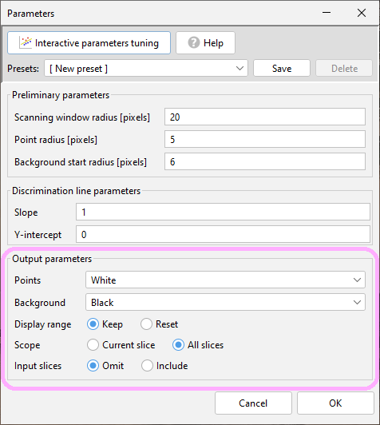
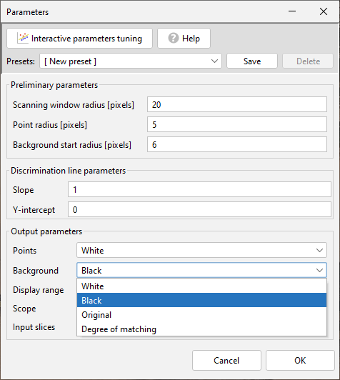

# Background Remover Help - PL

## Instalacja i informacje wstępne

Aby móc używać zestawu narzędzi do przetwarzania obrazów z mikroskopu w celu wyszukania śladów po promieniowaniu należy pobrać plik BackgroundRemover.jar i umieścić go w katalogu Plugins (podkatalog katalogu ImageJ lub Figi.app). Po ponownym uruchomieniu programu powinien być on widoczny w menu rozwijanym w ImageJ: **Plugins -> Background Remover**.

W pierwszej kolejności należy wczytać plik w postaci pojedynczego obrazka albo stacku. Obraz (lub stos) powinien być 16-bitowy w odcieniach szarości. Plugin uruchamia się domyślnie dla aktywnego okna. 

Program może działać w dwóch trybach: automatycznym i manualnym. W trybie automatycznym możemy albo wpisać w poszczególnych polach ustalone wcześniej parametry, bądź też wczytać zapisany wcześniej zestaw parametrów (Preset).  Po kliknięciu OK program automatycznie wyszukuje punkty i otwiera nowe okno z obrazem wynikowym. Do trybu manualnego przechodzimy za pomocą przycisku **Interactive parameters tuning** znajdującego się w lewej górnej części okna.

## Tryb automatyczny

Prosty w obsłudze tryb automatyczny służący do wykonania przekształceń zgodnie z podanymi przez użytkownika parametrami. Parametry te można zarówno wpisać ręcznie jak i wczytać z pliku.

### Presets

Aby utworzyć nowy preset wystarczy wybrać z listy rozwijanej **Presets** opcję **[ New ]** i po uzupełnieniu wszystkich pól ustalonymi parametrami kliknąć przycisk **Save**. Otworzy się nowe okno, z prośbą o podanie nazwy zapisywanego presetu. Po wybraniu nazwy i zatwierdzeniu utworzony preset pojawi się na rozwijanej liście presetów na górze okna. 

Aby przejść do utworzonego wcześniej presetu wystarczy wybrać go z listy rozwijanej **Presets**. Istniejący preset można aktualizować zachowując wprowadzone zmiany przy pomocy przycisku **Save**. Można go również usunąć używająć przycisku **Delete**. Wybranie na liście rozwijanej opcji **[ Recently used ]** spowoduje wczytanie ostatnio stosowanego presetu. Preset może zostać usunięty za pomocą przycisku **Delete**.

### Preliminary parameters

Parametry wstępne określające wielkość okna skanującego oraz orientacyjną wielkość obietków na obrazie. 

- **Scanning window radius** - wielkość okna skanującego podana w pikselach (połowa długości boku kwadratu);
- **Point radius** - wielkość punktu podana w pikselach (promień);
- **Background start radius** - odległość od analizowanego punktu, powyżej której położone piksele traktowane są jako tło (odległość ta powinna być większa niż **Point radius**).

### Discrimination line parameters

Do oddzielenia sygnału od szumu program posługuje się odpowiednio dopasowaną prostą dyskryminacji o równaniu:

$$
  y = a*x+b
$$

- **Slope** - współczynnik kierunkowy prostej dyskryminacji (a);
- **Y-Intercept** - punkt przecięcia prostej dyskryminacyji z osią OY (b).

Jeżeli parametry te nie są znane, należy je ustalić w trybie manualnym.

### Output parameters

Parametry określające własności obrazu wyjściowego.

- **Points** - dostępne na liście rozwijanej opcje wyświetlenia punktów:
  - **White** - punkty wyświetlane na biało;
  - **Black**- punkty wyświetlane na czarno;
  - **Orginal** - punkty wyświetlane takie same jak na obrazie oryginalnym;
  - **Degree of matching** - jasność pikseli odpowiada różnicy między wyliczoną przez program "jasnością punktu", a "jasnością tła" (im jaśniejszy punkt, tym bardziej "wystaje on ponad tło");
  - **Net signal (average)** - wartość pikseli odpowiada podstawowej wartości pikseli pomniejszonej o tło wyliczone jako średnia arytmetyczna pikseli wokół danego punktu;
  - **Net signal (mode)** - wartość pikseli odpowiada podstawowej wartości pikseli pomniejszonej o tło wyliczone jako wartość modalna pikseli wokół danego punktu;
  - **Net signal (median)** - wartość pikseli odpowiada podstawowej wartości pikseli pomniejszonej o tło wyliczone jako mediana pikseli wokół danego punktu;

Jeżeli wybrana zostanie jedna z opcji **Net signal**, to pojawią się dwa dodatkowe pola z parametrami do ustalenia:
- **Skip pixels** - różnica między promieniem punktu, dla którego liczone jest tło, a promieniem wewnętrzym pierścienia, na podstawie którego obliczana jest wartość tła.
- **Take pixels** - różnica między promieniem zewnętrzym a wewnętrznym pierścienia służącego do obliczenia tła.

Dodatkowo przy wyborze jednej z trzech wersji **Net signal** można dodatkowo zaznaczyć opcję **Scaled** - wartości pikseli zostają rozciągnięte na cały zakres wyświetlania (zwiększony zostaje kontrast na obrazie). Należy zwrócić uwagę, że użycie tej opcji zmienia zarówno bezwzględne jak i względne zależności między wartościami poszczególnych pikseli. Zaleca się stosować go głównie w celach wizualnych.

- **Background** - dostępne opcje wyświetlenia tła:
  - **White** - tło wyświetlane na biało;
  - **Black** - tło wyświetlane na czarno;
  - **Orginal** - tło wyświetlane takie same jak na obrazie oryginalnym;
  - **Degree of matching** - jasność pikseli odpowiada różnicy między wyliczoną przez program "jasnością punktu", a "jasnością tła";

Dodatkowe opcje:
- **Scope** - wybieramy czy plugin ma wykonać operacje tylko na wybranym obrazie (**Current slice**), czy na wszystkich obrazach w stosie w aktywnym oknie (**All slices**);
- **Input slices** - opcja umożliwiająca wybór czy jako wynik otrzymamy stos przetworzonych obrazów (**Omit**), czy stos, gdzie wynikowe obrazy przeplatane są odpowiadającymi im oryginalnymi obrazami (**Include**) (funkcja przydatna np. przy porównywaniu obrazów wynikowych i oryginalnych lub tworzeniu masek).
- **Display range** - dla wybranego obrazu (lub stosu) zakres wyświetlania pozostaje niezmieniony (**Keep**) lub zostaje przesunięty tak, aby wartość piksela równa 0 odpowiadała kolorowi czarnemu (**Reset**). Ta transformacja zmienia bezwzględne wartości pikseli, ale zamchowuje ich wartości względne. Przykładowo jeżeli bazowo zakres wyświetlania jest równy 1746.0 - 15951.0, gdzie 1746.0 odpowiadało najciemniejszemu pikslelowi na obrazie (kolorowi czarnemu), a 15951.0 odpowiadało pikselowi najjaśniejszemu (kolorowi białemu) to po wykonaniu transformacji piksele przyjmą wartości z zakresu 0 - 14205.0. Wartość każdego piksela w każdym z obrazów w stosie została obniżona o 1746.0 i aktualnie piksele w kolorze czarnym mają wartość 0, natomiast piksele w kolorze białym mają wartość 14205.0.

## Tryb manualny

W trybie manualnym parametry możemy ustalać na bieżąco. Po wybraniu opcji Manual mode i kliknięciu OK przechodzimy do trybu manualnego ustalania parametrów. Otwiera się seria okien. W pierwszej kolejności w Menu ustalamy wielkość okna skanującego (Scaning window size). 

TIP: Im gęściej rozmieszczone punkty tym rozmiar okna powinien być mniejszy.

Następnie podajemy przewidywany rozmiar punktów.

TIP: Można przybliżyć obraz, aby orientacyjnie ocenić wielkość punktów.

Krok kolejny to zaznaczenie w oknie Noise obszarów, które zawierają wyłącznie szum/tło. W tym celu można użyć dowolnego narządzia wyboru z ImageJ. Aby dodać kolejne obszary należy trzymać wciśnięty przycisk SHIFT. 

TIP: Ważne jest aby zaznaczyć obszary tła o jak najbardziej zróżnicowanej jasności.

Wybrane obszary zostają zaznaczone na wykresie w oknie Plot. Na poniższym wykresie poszczególne grupy punktów odpowiadają obszarom oznaczonym na zdjęciu. Warto zwrócić uwagę na różne poziomy jasności zaznaczonych obszarów

W kolejnym etapie w oknie Points za pomoca narzędzia wyboru punktów z ImageJ zaznaczamy punkty. Oznaczone punkty pojawiają się na wykresie w oknie Plot.

Aby zaznaczać kolejne punkty należy trzymać wciśnięty przycisk SHIFT. 

TIP: Ważne jest oznaczenie szczególnie tych punktów, które w najmniejszym stopniu odróżniają się od otaczającego je tła. W tym celu warto powiększyć sobie wybrane obszary obrazu.

Po zaznaczeniu obszarów szumu i punktów możemy dopasować ręcznie prostą odcinającą szum od punktów. (Można albo po prostu przesunąć istniejącą już na wykresie prostą, albo narysować właśną za pomocą narzędzia rysowania prostej z ImageJ.) Parametry prostej pokazują się na bieżąco w oknie Menu, natomiast obraz wynikowy można podejrzeć w oknie Preview. Przesuwając pasek na dole okna można podejrzeć porównanie obrazu wejściowego i wynikowego.

Plugin umieszcza adnotacje odnośnie wykonanych na pliku operacji. Można je prześledzić wchodząc w **Image -> Show Info...**.

Należy mieć na uwadze, że ze względu na pewną specyfikę działania ImageJ adnotacje wyświetlają się w losowej kolejności. Należy je odczytywać w kolejności zgodnej z podaną po prawej stronie numeracją.

