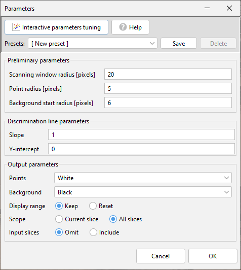
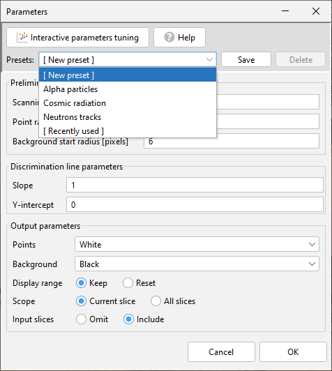
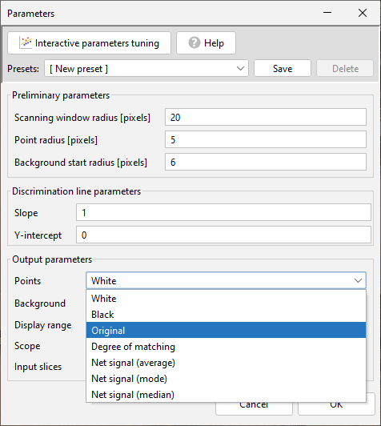
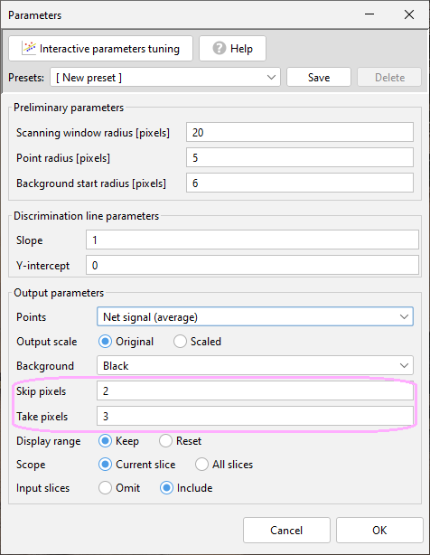
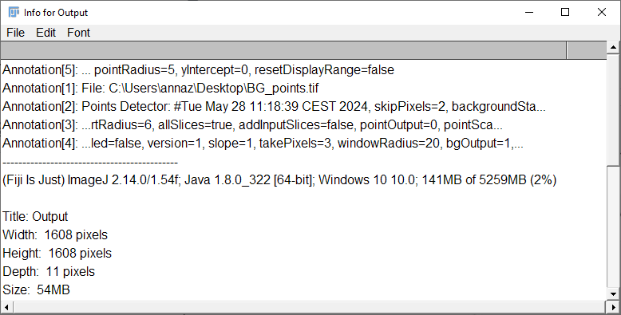

# Background Remover Help

## Installation and introductory information

In order to use the microscope image processing toolkit for separating signal from noise, you will need to download the BackgroundRemover.jar file and place it in the Plugins directory, which is a subdirectory of either the ImageJ or Figi.app directory. After restarting the program, the toolkit will be readily accessible in the drop-down menu under ImageJ: **Plugins -> Background Remover**.

The file should be imported as a single image or a stack. The image (or stack) must be in a 16-bit grayscale. By default, the plugin is run for the active window.

The program has two modes: automatic and manual. In automatic mode, we can enter predetermined parameters in individual fields or load a previously saved set of parameters (Preset). After clicking OK, the program automatically searches for points and opens a new window with the resulting image. We switch to manual mode using the "**Interactive parameters tuning**" button located in the upper left part of the window.

## Automatic mode

The automatic mode is easy to use and performs transformations based on user-provided parameters. These parameters can be entered manually or loaded from a file.

### Presets

The new preset can be created by selecting the **[ New ]** option from the **Presets** drop-down list. After all the fields with the set parameters have been completed, the **Save** button should be clicked. A new window will open, asking for the name of the preset being saved. Once a name is selected and confirmed, the created preset will appear in the preset drop-down list at the top of the window.

To access a previously created preset, it can be selected from the **Presets** drop-down list. The existing preset can be updated while maintaining the changes made using the **Save** button. By selecting **[Recently used]** from the drop-down list, the most recently used preset will be loaded. The preset can be deleted using the **Delete** button.

### Preliminary parameters

Preliminary parameters determine the size of the scanning window and the approximate size of objects in the image.

- **Scanning window radius** - the size of the scanning window in pixels (half the length of the side of the square);
- **Point radius** - point size in pixels (radius);
- **Background start radius** - distance from the analyzed point, above which pixels located are treated as background (this distance should be greater than **Point radius**).

### Discrimination line parameters

To separate the signal from the noise, the program uses an appropriately adjusted discrimination line with the equation:

$$
  y = a*x+b
$$

- **Slope** - slope coefficient of simple discrimination (a);
- **Y-Intercept** - the point of intersection of the discrimination line with the OY axis (b).

Jeżeli parametry te nie są znane, należy je ustalić w trybie manualnym.

### Output parameters

If these parameters are not known, they should be set in manual mode.

- **Points** - dostępne na liście rozwijanej opcje wyświetlenia punktów:
  - **White** - punkty wyświetlane na biało;
  - **Black**- punkty wyświetlane na czarno;
  - **Orginal** - punkty wyświetlane takie same jak na obrazie oryginalnym;
  - **Degree of matching** - jasność pikseli odpowiada różnicy między wyliczoną przez program "jasnością punktu", a "jasnością tła" (im jaśniejszy punkt, tym bardziej "wystaje on ponad tło");
  - **Net signal (average)** - wartość pikseli odpowiada podstawowej wartości pikseli pomniejszonej o tło wyliczone jako średnia arytmetyczna pikseli wokół danego punktu;
  - **Net signal (mode)** - wartość pikseli odpowiada podstawowej wartości pikseli pomniejszonej o tło wyliczone jako wartość modalna pikseli wokół danego punktu;
  - **Net signal (median)** - wartość pikseli odpowiada podstawowej wartości pikseli pomniejszonej o tło wyliczone jako mediana pikseli wokół danego punktu;

Jeżeli wybrana zostanie jedna z opcji **Net signal**, to pojawią się dwa dodatkowe pola z parametrami do ustalenia:
- **Skip pixels** - różnica między promieniem punktu, dla którego liczone jest tło, a promieniem wewnętrzym pierścienia, na podstawie którego obliczana jest wartość tła.
- **Take pixels** - różnica między promieniem zewnętrzym a wewnętrznym pierścienia służącego do obliczenia tła.

Dodatkowo przy wyborze jednej z trzech wersji **Net signal** można dodatkowo zaznaczyć opcję **Scaled** - wartości pikseli zostają rozciągnięte na cały zakres wyświetlania (zwiększony zostaje kontrast na obrazie). Należy zwrócić uwagę, że użycie tej opcji zmienia zarówno bezwzględne jak i względne zależności między wartościami poszczególnych pikseli. Zaleca się stosować go głównie w celach wizualnych.

- **Background** - dostępne opcje wyświetlenia tła:
  - **White** - tło wyświetlane na biało;
  - **Black** - tło wyświetlane na czarno;
  - **Orginal** - tło wyświetlane takie same jak na obrazie oryginalnym;
  - **Degree of matching** - jasność pikseli odpowiada różnicy między wyliczoną przez program "jasnością punktu", a "jasnością tła";

Dodatkowe opcje:
- **Scope** - wybieramy czy plugin ma wykonać operacje tylko na wybranym obrazie (**Current slice**), czy na wszystkich obrazach w stosie w aktywnym oknie (**All slices**);
- **Input slices** - opcja umożliwiająca wybór czy jako wynik otrzymamy stos przetworzonych obrazów (**Omit**), czy stos, gdzie wynikowe obrazy przeplatane są odpowiadającymi im oryginalnymi obrazami (**Include**) (funkcja przydatna np. przy porównywaniu obrazów wynikowych i oryginalnych lub tworzeniu masek).
- **Display range** - dla wybranego obrazu (lub stosu) zakres wyświetlania pozostaje niezmieniony (**Keep**) lub zostaje przesunięty tak, aby wartość piksela równa 0 odpowiadała kolorowi czarnemu (**Reset**). Ta transformacja zmienia bezwzględne wartości pikseli, ale zamchowuje ich wartości względne. Przykładowo jeżeli bazowo zakres wyświetlania jest równy 1746.0 - 15951.0, gdzie 1746.0 odpowiadało najciemniejszemu pikslelowi na obrazie (kolorowi czarnemu), a 15951.0 odpowiadało pikselowi najjaśniejszemu (kolorowi białemu) to po wykonaniu transformacji piksele przyjmą wartości z zakresu 0 - 14205.0. Wartość każdego piksela w każdym z obrazów w stosie została obniżona o 1746.0 i aktualnie piksele w kolorze czarnym mają wartość 0, natomiast piksele w kolorze białym mają wartość 14205.0.

## Tryb manualny

W trybie manualnym parametry możemy ustalać na bieżąco. Po wybraniu opcji Manual mode i kliknięciu OK przechodzimy do trybu manualnego ustalania parametrów. Otwiera się seria okien. W pierwszej kolejności w Menu ustalamy wielkość okna skanującego (Scaning window size). 

TIP: Im gęściej rozmieszczone punkty tym rozmiar okna powinien być mniejszy.

Następnie podajemy przewidywany rozmiar punktów.

TIP: Można przybliżyć obraz, aby orientacyjnie ocenić wielkość punktów.

Krok kolejny to zaznaczenie w oknie Noise obszarów, które zawierają wyłącznie szum/tło. W tym celu można użyć dowolnego narządzia wyboru z ImageJ. Aby dodać kolejne obszary należy trzymać wciśnięty przycisk SHIFT. 

TIP: Ważne jest aby zaznaczyć obszary tła o jak najbardziej zróżnicowanej jasności.

Wybrane obszary zostają zaznaczone na wykresie w oknie Plot. Na poniższym wykresie poszczególne grupy punktów odpowiadają obszarom oznaczonym na zdjęciu. Warto zwrócić uwagę na różne poziomy jasności zaznaczonych obszarów

W kolejnym etapie w oknie Points za pomoca narzędzia wyboru punktów z ImageJ zaznaczamy punkty. Oznaczone punkty pojawiają się na wykresie w oknie Plot.

Aby zaznaczać kolejne punkty należy trzymać wciśnięty przycisk SHIFT. 

TIP: Ważne jest oznaczenie szczególnie tych punktów, które w najmniejszym stopniu odróżniają się od otaczającego je tła. W tym celu warto powiększyć sobie wybrane obszary obrazu.

Po zaznaczeniu obszarów szumu i punktów możemy dopasować ręcznie prostą odcinającą szum od punktów. (Można albo po prostu przesunąć istniejącą już na wykresie prostą, albo narysować właśną za pomocą narzędzia rysowania prostej z ImageJ.) Parametry prostej pokazują się na bieżąco w oknie Menu, natomiast obraz wynikowy można podejrzeć w oknie Preview. Przesuwając pasek na dole okna można podejrzeć porównanie obrazu wejściowego i wynikowego.

Plugin umieszcza adnotacje odnośnie wykonanych na pliku operacji. Można je prześledzić wchodząc w **Image -> Show Info...**.

Należy mieć na uwadze, że ze względu na pewną specyfikę działania ImageJ adnotacje wyświetlają się w losowej kolejności. Należy je odczytywać w kolejności zgodnej z podaną po prawej stronie numeracją.

